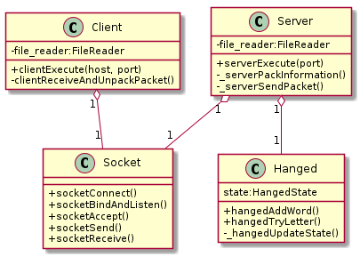
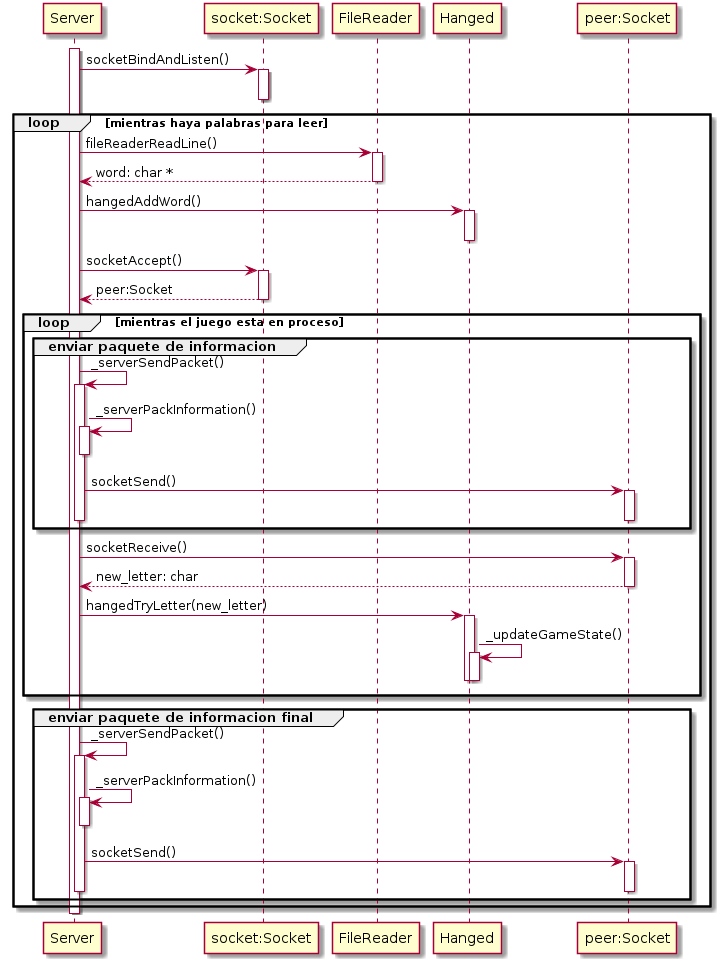
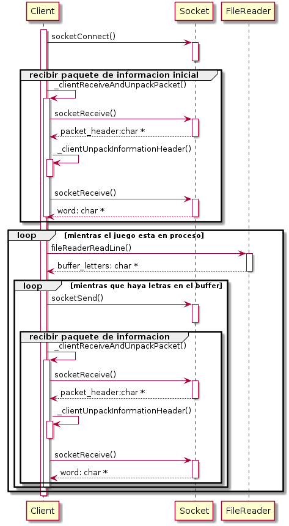

# Ejercicio 1: Ahorcado
## Taller de Programación I

**Matias Charrut** - 101137

[Link al repositorio](https://github.com/mati1297/tp1_taller1)

## Descripción

El ejercicio consistió en el armado de un juego del ahorcado distribuido, es decir, que tiene dos partes. Una es el servidor, el cual lee palabras desde un archivo de texto y se pone a disposición de que los clientes se conecten a el, uno a la vez. La otra parte es el cliente, el cual se conecta al servidor y recibe de el la informacion sobre el juego y su estado. Además, es quien interactúa con el usuario, leyendo las letras que ingresa éste y enviandoselas al servidor.

Para la resolucion del problema se planteó primeramente la construcción del juego, constituido por el TDA ```Hanged```, el cual representa al juego en su totalidad. Este TDA se abstrae totalmente de la implementación del juego en la manera distribuida, por lo que podría ser ejecutado sin utilizar un server y un cliente. Sus funciones se componen de inicializadores y desinicializadores, una función que permiten agregar una palabra al juego eliminando la anterior(```hangedAddWord()```), una función que permite probar una letra y validar si la partida terminó y cual fue el resultado (```hangedTryLetter()```) y una serie de getters utilizados por otras partes del programa. Además cuenta con algunas funciones de tipo ```static``` que son usadas de manera privada por el TDA.

Luego, el programa tiene sus dos TDAs principales: ```Server``` y ```Client```. Estos serán directamente manejados a través de sus métodos por el main correspondiente a cada uno. Ambos tienen una estructura similar, teniendo funciones para inicializar, ejecutar, y desinicializar. Ambos poseen una instancia del TDA ```Socket```, para la comunicación, y otra del TDA ```FileReader```, para la lectura de de datos que le corresponde a cada uno. Además, el TDA ```Server``` posee una instancia de ```Hanged```, en donde se ejecuta el juego.

```Client``` no tiene ninguna información sobre el estado del juego más que la que recibe de parte del server. Por lo que unicamente se encarga de recibir datos, desempaquetarlos y mostrarlos por pantalla. Luego recibe los datos de entrada y los envía al server. Toda la validación y lógica del juego es realizada en el server. Lo único que verifica es que el caracter sea valido, para poder mostrar un mensaje al usuario notificandolo. 

Para la comuncición se utiliza el TDA ```Socket```. El cual permite y encapsula el uso de los sockets. Este posee funciones útiles tanto para el server como para el cliente: funciones de conexión (como ```socketConnect()```, ```socketBindAndListen()```, ```socketAccept()```) y funciones que permiten enviar y recibir datos (```socketSend()``` y ```socketReceive()```).

Para la lectura de archivos, se utiliza el TDA ```FileReader()```. Que permite el manejo de archivos (o el flujo stdin). Su función principal utilizada en el programa es ```fileReaderReadLine()```, la cual permite leer una linea desde la entrada. Este TDA se utiliza tanto para la lectura de palabras desde el archivo de entrada como para la lectura de las letras que se ingresan en el cliente a traves de ```STDIN```.

### Sobre el uso del heap

Para las palabras del juego, se decidió utilizar el heap en vez del stack, esto se debe a que el protocolo de envío destina 2 bytes al tamaño de la palabra, por lo que puede tener un largo máximo de 65535. Por lo tanto se elige utilizar memoria dinámica para optimizar el programa, ya que lo más probable es que pocas veces se ingresen palabras cercanas al máximo tamaño valido. Esto se extiende tanto a la propia lectura en ```Server```, como al guardado de las palabras en el TDA ```Hanged``` y a la recepcion de la misma por parte de ```Client```.

También se utiliza memoria dinámica al momento de leer las letras que se prueban en el juego por parte de ```Client```, ya que la cantidad de letras por línea máxima no está especificada. En este caso, el uso de memoria dinámica se limita solamente a la lectura ya que los caracteres son enviados de a uno al ```Server```.

## Diagramas

Se muestran a continuación algunos diagramas del funcionamiento del programa. El primero se puede observar un diagrama de TDAs reducido del programa. Se puede ver que ```Client``` y ```Server``` no se conocen entre si, y ambos poseen y utilizan instancias de ```Socket```. Además, se puede ver que ```Server``` posee una instancia del juego ```Hanged```.

<p align=center>
    
</p>

En las dos figuras siguientes se pueden ver diagramas de secuencia de la ejecución de ```Server```y de ```Client``` respectivamente, mostrando su interacción con los demás TDA.

<p align=center>
    
</p>
<p align=center>
    
</p>
